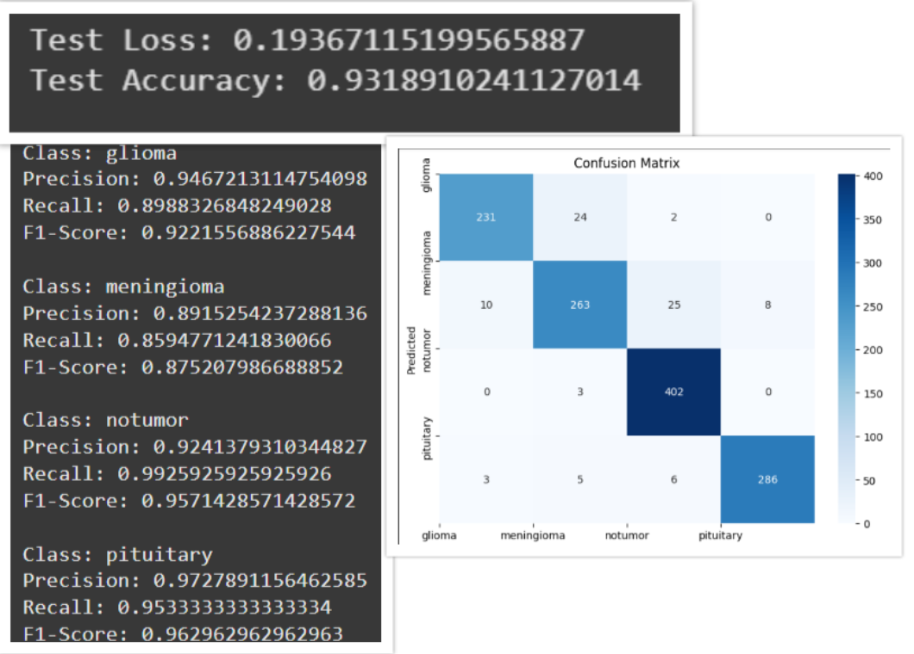

# 🧠 Brain Tumor Detection Using Deep Learning and Transformers

Welcome to the Brain Tumor Detection project! This project leverages advanced deep learning techniques to accurately detect and classify brain tumors from MRI scans.

## 🖼️ MODEL ACCURACY & EVALUATION METRICS 




## 🖼️ USER INTERFACE


## 🚀 Project Overview

**Objective:**
Develop a hybrid Convolutional Neural Network (CNN) model utilizing ResNet50 and VGG16 architectures to classify brain tumors into four categories:
- Glioma
- Meningioma
- Pituitary Tumor
- No Tumor

**Dataset:**
The model is trained and tested on MRI scan images categorized into:
- Glioma
- Meningioma
- Pituitary
- No Tumor

## 🛠️ Technologies Used

**Programming Language:** Python

**Libraries and Frameworks:**
- NumPy
- OpenCV
- TensorFlow
- Gradio
- Matplotlib
- Seaborn
- Pandas

## 🏗️ Model Architecture

### Feature Extraction:
Utilizes pre-trained models:
- ResNet50
- VGG16
- Initial layers are frozen to retain pre-trained features.

### Data Augmentation:
Techniques applied:
- Rotation
- Width and height shifts
- Shear
- Zoom
- Horizontal and vertical flips

### Fully Connected Layers:
- Global Average Pooling layers
- Dense layers with ReLU activation
- Dropout layers for regularization
- Output layer with softmax activation for multi-class classification

## 📊 Model Performance

**Accuracy:** 92.5%
**Precision:** 90.3%
**Recall:** 91.7%

Confusion Matrix and performance graphs can be found in the repository.

## 🔍 How to Use

### Clone the Repository:
```bash
git clone https://github.com/shreyasskrishna/Brain_tumour_prediction.git
```

### Install Dependencies:
```bash
pip install -r requirements.txt
```

### Run the Application:
```bash
python app.py
```

### Upload MRI Scan:
- Access the Gradio interface.
- Upload your MRI scan image.
- Receive the tumor classification and suggested recovery plan.

## 🏥 Tumor Categories and Recovery Plans

### **Meningioma:**
**Stages:** Stage 1-3  
**Recovery Methods:**
- Minimally invasive neurosurgery with neuronavigation.
- Proton beam therapy for targeted radiation.
- Post-treatment: AI-assisted MRI monitoring, personalized rehabilitation.
- Lifestyle: Anti-inflammatory diet, meditation, yoga.

### **Glioma:**
**Stages:** Stage 1-4  
**Recovery Methods:**
- Combination therapy—tumor resection, localized radiation, chemotherapy.
- Emerging solutions: Tumor Treating Fields (TTFields), immunotherapy trials.
- Post-treatment: Machine learning-based progression tracking.
- Lifestyle: Ketogenic diet research, cognitive rehabilitation exercises.

### **Pituitary Tumor:**
**Stages:** Non-staged  
**Recovery Methods:**
- Dopamine agonists for prolactinomas, transsphenoidal surgery if necessary.
- Emerging solutions: Gene therapy, robotic-assisted surgeries.
- Post-treatment: AI-driven endocrine monitoring, vision and neurological assessments.
- Lifestyle: Sleep optimization, stress reduction, balanced nutrition.

### **No Tumor:**
**Preventive Measures:**
- Regular neuro check-ups, brain-training activities, mindfulness meditation.
- Cognitive enhancement: Nootropic supplements (under supervision), intermittent fasting.
- Physical health: Cardiovascular exercises, social engagement.
- Nutritional support: Mediterranean diet rich in healthy fats and greens.


## 🤝 Contributing
We welcome contributions! Please fork the repository and submit a pull request with your enhancements.

## 📄 License
This project is licensed under the MIT License.

**Note:** This project is for educational purposes and should not be used as a substitute for professional medical advice.
